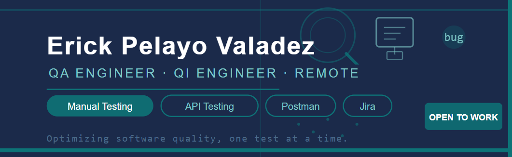

# Hi! I'm Erick Pelayo 👋

### Junior Quality Assurance Engineer | API Testing Specialist

---

## 🔍 About Me

I am a **Junior Quality Assurance (QA) Engineer** based in **Coahuila, Mexico**, with a strong foundation in manual and API testing. My goal is to ensure high-quality software delivery, bug-free and aligned with user requirements, optimizing quality "one test at a time."

* 🧪 **Specialties:** Manual Testing, API Testing, Bug Reporting & Tracking.
* 🛠️ **Favorite Tools:** Postman, Jira, Git.
* 🎓 **Education:** QA Program at TripleTen (2025).
* 🌍 **Availability:** Open to Remote or Hybrid opportunities.

## 🛠️ Testing & Management Stack

| Category | Technologies & Tools |
| :--- | :--- |
| **Manual Testing** | Test Case Design, Test Execution, Exploratory Testing |
| **API Testing** |  REST, JSON |
| **Management** |  Trello, Agile Methodologies |
| **Dev Tools** |   |

## 📊 My GitHub Stats

  
   
  

---

  <i>"Optimizing software quality, one test at a time."</i>

